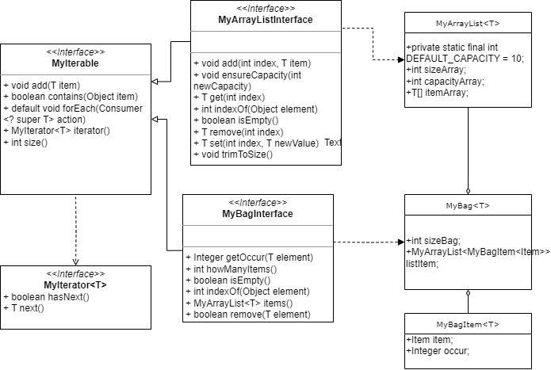

# Configuration
System: Windows 11
## Install JDK, Maven, Git
- JDK 17: https://www.oracle.com/java/technologies/javase/jdk17-archive-downloads.html
- Maven: https://maven.apache.org/download.cgi
- Git: https://git-scm.com/downloads

To avoid sensitive characters in path, recommend to create a folder with a "safe" name to install all packages. 

After downloading, install those packages and add PATH to make them accessible. 

Check the version:
```
java --version 
mvn --version
git --version
```
## Create project
- Initialize a Maven project with this command:
 ``` mvn archetype:generate -DgroupId=[main package] -DartifactId=[repo name] -DarchetypeArtifactId=[project template] -DinteractiveMode=false ``` where:
  - main package = ru.spbstu.telematics.java
  - repo name = JavaLabs
  - project template = maven-archetype-quickstart
 

- After initialization, create a repo on Git, then use these commands to link the local repo to the upstream branch:
```
git init (initialize git project)
git remote add origin [repo link] 
(this will create the local branch "master", which conflicts with the upstream branch "main")
git branch -m master main 
(change the name of branch if needed)
git pull origin main --allow-unrelated-histories (allow mismatched histories)
```
From now you can commit as usual. 

- To execute jar file, you need to include *maven jar plugin* into pom.xml
```
 <build>
  <plugins>
    <plugin>
      <!-- Build an executable JAR -->
      <groupId>org.apache.maven.plugins</groupId>
      <artifactId>maven-jar-plugin</artifactId>
      <version>3.1.0</version>
      <configuration>
        <archive>
          <manifest>
            <mainClass>ru.spbstu.telematics.java.App</mainClass>
          </manifest>
        </archive>
      </configuration>
    </plugin>
  </plugins>
</build>
```
# Execution
Using jar execution:
```
java -jar target\JavaLabs-1.0-SNAPSHOT.jar [command]
```
To use commons-cli with jar, we need to pack the jar file along with the dependencies. Add or replace maven-jar-plugin with this plugin:
```
<plugin>
      <artifactId>maven-assembly-plugin</artifactId>
      <configuration>
        <archive>
          <manifest>
            <mainClass>ru.spbstu.telematics.java.App</mainClass>
          </manifest>
        </archive>
        <descriptorRefs>
          <descriptorRef>jar-with-dependencies</descriptorRef>
        </descriptorRefs>
      </configuration>
    </plugin>
```

and build with command
```
mvn clean package assembly:single
```
The jar file with cli ends with *jar-with-dependencies*.

## Documentation
Visit https://dat-2k2.github.io/JavaLabs to see the docs.

# Program Structure
Each laboratory (short. *lab*) is put in a separated subpackage of the main pack *ru.spbstu.telematics.java*, named as **lab1, lab2,**... 

The class **App** mocks the CLI, which navigates the program to the respective task by the first argument. For example, the command argument for *Lab 1* is **ow** (overwrite).


The testing class using package **junit** contains every methods to test all functions. 

## Lab 1
This lab requires to write a program that helps overwrite an *existed* file with a text. 
### Overwriting method
The overwriting method open a file named *pathName*, then overwrite it by *buffer*. During execution it also needs to handle the case of nonexisted file.

### Main method
The main function executes the overwriting method of package **Lab 1** if it receives argument **ow**. 


### Testing
We need to test the general case of overwriting and the case of non-existed file. 

#### Overwriting
Prepare a file, write some data to it, then run the overwriting method *Lab1.overwriteFile*, read the new data and check whether they are the same with the overwritten. Here used *File*, *FileWriter* and *FileReader*.

#### FileNotFound
Test if the FileNotFound is handled, check if the method throw the exception.

## Lab 2
This lab requires to implement a Generic *Bag* in Java, which should include methods *size*, *contains*,  *add*, *remove*, *get* and some others if needed. 

*Bag* is a collection which accepts duplicates. It helps users quickly get the statistics of data. 

*Bag* has no direct class in Java, just *hashBag* and *treeBag* in Apache. To be simple here it's implemented with array. 

In addition, need to implement the _Iterable_ and _Iterator_ interfaces. 
### Program structure

<h4>Main</h4>
<p>
    
    <em>UML diagram of Lab 2</em>
</p>

*MyBag* takes a *MyArrayList* of *MyBagItem* as underlay array. The *MyBagItem* is simply a map from *T* to an *Integer*, which maps an item to its occurrences in the bag. 

<h4>Test</h4>

Need to test every function of the MyArrayList and the MyBag, listed in the diagram. 


