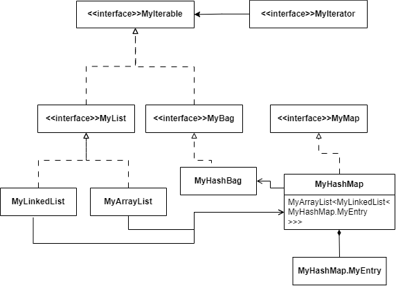
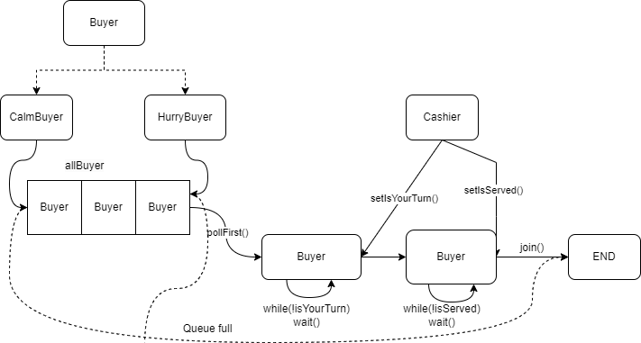
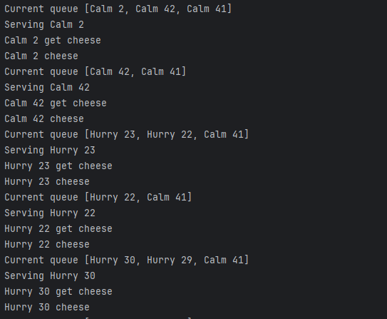

# Configuration
System: Windows 11
## Install JDK, Maven, Git
- JDK 17: https://www.oracle.com/java/technologies/javase/jdk17-archive-downloads.html
- Maven: https://maven.apache.org/download.cgi
- Git: https://git-scm.com/downloads

To avoid sensitive characters in path, recommend to create a folder with a "safe" name to install all packages. 

After downloading, install those packages and add PATH to make them accessible. 

Check the version:
```
java --version 
mvn --version
git --version
```
## Create project
- Initialize a Maven project with this command:
 ``` mvn archetype:generate -DgroupId=[main package] -DartifactId=[repo name] -DarchetypeArtifactId=[project template] -DinteractiveMode=false ``` where:
  - main package = ru.spbstu.telematics.java
  - repo name = JavaLabs
  - project template = maven-archetype-quickstart
 

- After initialization, create a repo on Git, then use these commands to link the local repo to the upstream branch:
```
git init (initialize git project)
git remote add origin [repo link] 
(this will create the local branch "master", which conflicts with the upstream branch "main")
git branch -m master main 
(change the name of branch if needed)
git pull origin main --allow-unrelated-histories (allow mismatched histories)
```
From now you can commit as usual. 

- To execute jar file, you need to include *maven jar plugin* into pom.xml
```
 <build>
  <plugins>
    <plugin>
      <!-- Build an executable JAR -->
      <groupId>org.apache.maven.plugins</groupId>
      <artifactId>maven-jar-plugin</artifactId>
      <version>3.1.0</version>
      <configuration>
        <archive>
          <manifest>
            <mainClass>ru.spbstu.telematics.java.App</mainClass>
          </manifest>
        </archive>
      </configuration>
    </plugin>
  </plugins>
</build>
```
# Execution
Using jar execution:
```
java -jar target\JavaLabs-1.0-SNAPSHOT.jar [command]
```
To use commons-cli with jar, we need to pack the jar file along with the dependencies. Add or replace maven-jar-plugin with this plugin:
```
<plugin>
      <artifactId>maven-assembly-plugin</artifactId>
      <configuration>
        <archive>
          <manifest>
            <mainClass>ru.spbstu.telematics.java.App</mainClass>
          </manifest>
        </archive>
        <descriptorRefs>
          <descriptorRef>jar-with-dependencies</descriptorRef>
        </descriptorRefs>
      </configuration>
    </plugin>
```

and build with command
```
mvn clean package assembly:single
```
The jar file with cli ends with *jar-with-dependencies*.

## Documentation
Visit https://dat-2k2.github.io/JavaLabs to see the docs.

# Program Structure
Each laboratory (short. *lab*) is put in a separated subpackage of the main pack *ru.spbstu.telematics.java*, named as **lab1, lab2,**... 

The class **App** mocks the CLI, which navigates the program to the respective task by the first argument. For example, the command argument for *Lab 1* is **ow** (overwrite). However for lab 2 and lab 3 argument is not required, just run the main method.

The testing class using package **junit** contains every methods to test all functions.
## Lab 1
This lab requires to write a program that helps overwrite an *existed* file with a text. 
### Overwriting method
The overwriting method open a file named *pathName*, then overwrite it by *buffer*. During execution it also needs to handle the case of nonexisted file.

### Main method
The main function executes the overwriting method of package **Lab 1** if it receives argument **ow**. 


### Testing
We need to test the general case of overwriting and the case of non-existed file. 

#### Overwriting
Prepare a file, write some data to it, then run the overwriting method *Lab1.overwriteFile*, read the new data and check whether they are the same with the overwritten. Here used *File*, *FileWriter* and *FileReader*.

#### FileNotFound
Test if the FileNotFound is handled, check if the method throw the exception.

## Lab 2
This lab requires to implement a *Bag* in Java, which should include methods *size*, *contains*,  *add*, *remove*, *get* and some others if needed.

*Bag* is an **unordered** collection which accepts duplicates. It helps users quickly get the statistics of data.

The basic implementation of *Bag* is *HashBag*, using *HashMap* as underlay structure. The *HashMap* support getting count of an item with complexity O(1).

### Program structure

<h4>Main</h4>
<p>
    
    </img>
</p>

The *MyArrayList* and the *MyLinkedList*, in fact, were not required to implement, instead the HashMap could use flat array and *Node* only. However, the Map must be added resizing and main methods of LinkedList must be implemented.

Need to implement a *Map* at first, then a *Bag* would be a Map with key as item and value as item's count.

<h4>Iterate</h4>

Iterate through all elements of Bag including it duplicates. However, action applied on each item will also effect other duplicates, since the return value is the key of item's entry in the hash table.

<h4>Add</h4>

An item added to *Bag* will increase its count there, or create a new entry with count 1 if there hasn't been any entry of the item. Due to hashing, adding order is not reserved.

<h4>Remove</h4>

Remove an item will remove all its counts in the bag, or remove a certain quantity if the number is specified. 

<h4>Get (getCount)</h4>

Get in *Bag* means getting its count. Non-presented item has count 0.

### Test

Use a valid HashBag from Common Apache to validate the MyHashBag. A class *A* with 2 child classes *B* and *C* were created to ensure generality in testing. Test includes 3 main methods above and compare with valid methods of HashBag. 

## Lab 3

**Customers**. The cheese department in the supermarket continuously gathers hungry customers. There are two types of buyers: **hurry buyers** who push to get ahead and demand service; and **calm buyers** who patiently wait for service. The service request is indicated by the “getCheese” action, and the end of the service is indicated by the “Cheese” action. There is always cheese available, and a constant number of two **hurry** buyers and two **calm** ones. Each customer must be created as a separate thread that enters the queue, is served, and stops working.

### Program structure
<h4>Main</h4>
<p>
    
    </img>
</p>

A *Buyer* is initialized with a name and a queue of *Buyer*. Depending on behaviour, it will be added to the first or last of the queue. Each Buyer will wait until its turn indicator is true. Utility class *Cashier* concurrently gets the first buyer of the queue, wakes them up and sells cheese to them. After that the *Buyer* ends its routine.

The main method randomly and eventually generates *Buyer* to simulate the problem scene.

<h4>Buyer </h4>

Buyer waits until *isYourTurn* is true. *wait()* should be inside a while loop.
After the cashier wakes the *Buyer* up, start to order. 
```
    @Override
    public void run() {
        //come to the queue
        if (!toQueue(queue)) {
            System.out.println("[" + nameBuyer + "]: Queue full");
            return;
        }

        waitTillTurn();
        //request order
        System.out.println(this.nameBuyer + " get cheese");
        waitTillServed();
        System.out.println(this.nameBuyer + " cheese");
    }
```

<h4>Cashier</h4>

*Cashier* is an utility class. Its method *sell()* takes the first *Buyer* out of the queue, serve it and waits until the *Buyer* ends its routine.

```
static void sell(BlockingDeque<Buyer> allBuyer){
        Buyer currentBuyer;
        System.out.println("Current queue " + allBuyer);
        currentBuyer = allBuyer.pollFirst();

        //Buyer can join the queue while Cashier is selling so no sync here.
        if (currentBuyer != null){
            System.out.println("Serving "+currentBuyer.nameBuyer);
            //wake it up
            synchronized (currentBuyer){
                currentBuyer.setYourTurn(true);
                currentBuyer.notifyAll();
                waiting(TIME_SERVE);
                currentBuyer.setServed(true);
                currentBuyer.notifyAll();
                //wait till the Buyer exit before serving another
                try {
                    currentBuyer.join();
                } catch (InterruptedException e) {
                    System.out.println("Buyer "+ currentBuyer.nameBuyer +" is interrupted");
                }
            }
        }
}
```
### Result
This solution doensn't take account of the condition of 2 Calm and 2 Hurry Buyers in a queue, instead it solves the problem with any queue of buyers.


<p>
    
    </img>
</p>


