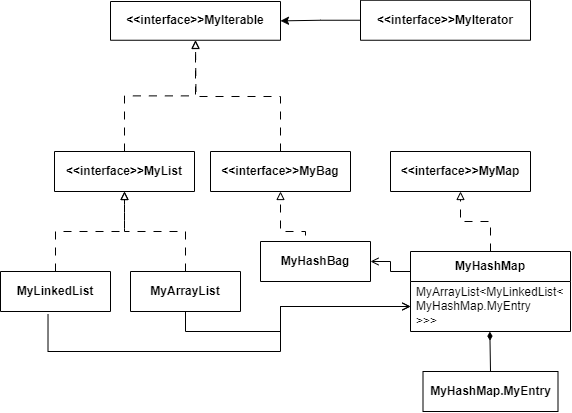
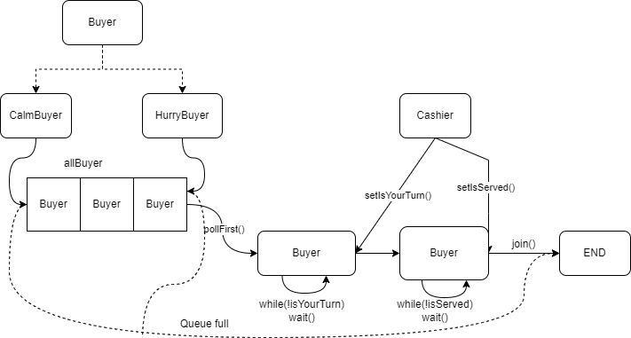
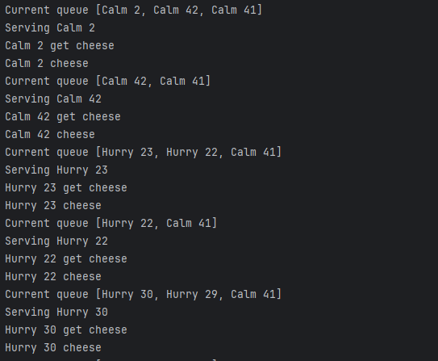

# Configuration
System: Windows 11
## Install JDK, Maven, Git
- JDK 17: https://www.oracle.com/java/technologies/javase/jdk17-archive-downloads.html
- Maven: https://maven.apache.org/download.cgi
- Git: https://git-scm.com/downloads

To avoid sensitive characters in path, recommend to create a folder with a "safe" name to install all packages.

After downloaded, install those packages and add PATH to make them accessible.

Check the version:
```
java --version 
mvn --version
git --version
```
## Create project

1. Initialize a Maven project with this command: ``` mvn archetype:generate -DgroupId=[main package] -DartifactId=[repo name] -DarchetypeArtifactId=[project template] -DinteractiveMode=false ``` where:
    - main package = ru.spbstu.telematics.java
    - repo name = JavaLabs
    - project template = maven-archetype-quickstart


2. After initialization, create a repo on Git, then use these commands to link the local repo to the upstream branch:

```
  git init (initialize git project)
  
  git remote add origin [repo link] 
  (this will create the local branch "master", which conflicts with the upstream branch "main")
  
  git branch -m master main (change the name of branch if needed)
  
  git pull origin main --allow-unrelated-histories (allow mismatched histories)
```

From now you can commit as usual.

3. To execute jar file, you need to include *maven jar plugin* into pom.xml

```xml
<build>
 <plugins>
   <plugin>
     <!-- Build an executable JAR -->
     <groupId>org.apache.maven.plugins</groupId>
     <artifactId>maven-jar-plugin</artifactId>
     <version>3.1.0</version>
     <configuration>
       <archive>
         <manifest>
           <mainClass>ru.spbstu.telematics.java.App</mainClass>
         </manifest>
       </archive>
     </configuration>
   </plugin>
 </plugins>
</build>
```
# Execution
The default main class for this repo is Main of Lab 1 (see [Lab 1](#lab-1)) with Apache Commons CLI. 
```
java -jar target\JavaLabs-1.0-SNAPSHOT.jar [args]
```
To use commons-cli with jar, we need to pack the jar file along with the dependencies. Add or replace maven-jar-plugin with this plugin:

```xml
<plugin>
    <artifactId>maven-assembly-plugin</artifactId>
    <configuration>
      <archive>
        <manifest>
          <mainClass>ru.spbstu.telematics.java.App</mainClass>
        </manifest>
      </archive>
      <descriptorRefs>
        <descriptorRef>jar-with-dependencies</descriptorRef>
      </descriptorRefs>
    </configuration>
</plugin>
```


and build with command
```
mvn clean package assembly:single
```
The jar file with cli ends with *jar-with-dependencies*.

For other labs, see further description below.
## Documentation
Visit [JavaDoc](https://dat-2k2.github.io/JavaLabs/docs) to see the package documentation.

# Program Structure
Each laboratory (short. *lab*) is put in a separated subpackage of the main pack *ru.spbstu.telematics.java*, named as **lab1, lab2,**...

The testing class using package **junit** contains every methods to test all functions.

## Lab 1
This lab requires to write a program that helps overwrite an *existed* file with a text.
### MyFileUtility class
Class _MyFileUtility_ has only one static method 
```java 
  public static void overwriteFile(String pathName, String buffer) throws FileNotFoundException {
      if (!new File(pathName).exists()) {
          throw new FileNotFoundException("File " + pathName + " not found");
      }

      try {
          FileWriter writer = new FileWriter(pathName, false);
          writer.write(buffer);
          writer.close();
      } catch (IOException e) {
          System.out.println("Cannot open file " + pathName);
      }
  }
``` 
This method opens a file named *pathName*, then overwrite it by *buffer*. During execution it also needs to handle the case of nonexisted file.

### CLI handling
The _Main::main()_ method requires 2 parameters to overwrite a file: _f_ - file name, _d_ - data to overwrite. If the data for parameters does not present, program raises an error and print the _help_ menu. The program also provides _help_ option with flag _h_.
```java
  public static void main(String[] args) {
      try {
          CommandLine cmd = parser.parse(options, args);
          if (cmd.hasOption(help)) {
              HelpFormatter formatter = new HelpFormatter();
              formatter.printHelp("Usage:", "", options, "", true);
          }
          else if (cmd.hasOption(owFile)) {
              String fileName = cmd.getOptionValue(owFile);
              String data = cmd.getOptionValue(owData);

              if (fileName == null || data == null)
                  throw new ParseException("Argument error");

              System.out.println("Overwrite file " + fileName);
              MyFileUtility.overwriteFile(fileName, data);
          }
          else{
              throw new ParseException("");
          }
      }
      catch (FileNotFoundException | ParseException e) {
          System.out.println(e.getMessage());
          HelpFormatter formatter = new HelpFormatter();
          formatter.printHelp("Usage:", "", options, "", true);
      }
  }
```
### Testing
We need to test the general case of overwriting and the case of non-existed file.

#### Overwriting
Prepare a file, write some data to it, then run the overwriting method *Lab1.overwriteFile*, read the new data and check whether they are the same with the overwritten. Here used *File*, *FileWriter* and *FileReader*.

#### FileNotFound
Test if the FileNotFound is handled, check if the method throw the exception.

### Run
See [Execution](#execution).
## Lab 2
This lab requires to implement a *Bag* in Java, which should include methods *size*, *contains*,  *add*, *remove*, *get* and some others if needed.

*Bag* is an **unordered** collection which accepts duplicates. It helps users quickly get the statistics of data.

The basic implementation of *Bag* is *HashBag*, using *HashMap* as underlay structure. The *HashMap* support getting count of an item with complexity O(1).

### Program structure

<h4>Main</h4>
<p>
    
</p>

The *MyArrayList* and the *MyLinkedList*, in fact, were not required to implement, instead the HashMap could use flat array and *Node* only. However, the Map must be added resizing and main methods of LinkedList must be implemented.

Need to implement a *Map* at first, then a *Bag* would be a Map with key as item and value as item's count.

<h4>Iterate</h4>

Iterate through all elements of Bag including it duplicates. However, action applied on each item will also effect other duplicates, since the return value is the key of item's entry in the hash table.

<h4>Add</h4>

An item added to *Bag* will increase its count there, or create a new entry with count 1 if there hasn't been any entry of the item. Due to hashing, adding order is not reserved.

<h4>Remove</h4>

Remove an item will remove all its counts in the bag, or remove a certain quantity if the number is specified.

<h4>Get (getCount)</h4>

Get in *Bag* means getting its count. Non-presented item has count 0.

### Test

Use a valid HashBag from Common Apache to validate the MyHashBag. A class *A* with 2 child classes *B* and *C* were created to ensure generality in testing. Test includes 3 main methods above and compare with valid methods of HashBag.

### Run
(incoming)

## Lab 3

**Customers**. The cheese department in the supermarket continuously gathers hungry customers. There are two types of buyers: **hurry buyers** who push to get ahead and demand service; and **calm buyers** who patiently wait for service. The service request is indicated by the “getCheese” action, and the end of the service is indicated by the “Cheese” action. There is always cheese available, and a constant number of two **hurry** buyers and two **calm** ones. Each customer must be created as a separate thread that enters the queue, is served, and stops working.

### Program structure
<h4>Main</h4>
<p>
    
</p>

A *Buyer* is initialized with a name and a queue of *Buyer*. Depending on behaviour, it will be added to the first or last of the queue. Each Buyer will wait until its turn indicator is true. Utility class *Cashier* concurrently gets the first buyer of the queue, wakes them up and sells cheese to them. After that the *Buyer* ends its routine.

The main method randomly and eventually generates *Buyer* to simulate the problem scene.

<h4>Buyer </h4>
After started, _Buyer_ enters the waiting state until the state variable _isYourTurn_ is true, as well as the thread wakes up. After that, it again waits until the state variable _isServed_ is true, which means the customer is served, and exits.

A small trick was used here, that is the state variables _isYourTurn_ and _isServed_ should be a wrapped class of boolean type for the updated results to be observed when pass the variable to another function.

```java
    public void run() {
      //come to the queue
      if (!toQueue(queue)) {
          System.out.println("[" + nameBuyer + "]: Queue full");
          return;
      }

      //request order
      waitTill(this.isYourTurn);
      System.out.println(this.nameBuyer + " get cheese");

      //be served
      waitTill(this.isServed);
      System.out.println(this.nameBuyer + " cheese");
    }
```

<h4>Cashier</h4>

*Cashier* is an utility class. Its method *sell()* takes the *Buyer*, serve them and waits until the *Buyer* ends their routine. Method _run()_ eventually takes the first customer out of the queue to serve. 

When the queue is empty, _Cashier_ will try taking the customer out of the queue 5 times more. If the queue is still empty, the _Cashier_ will end their routine.

Method _run()_:

```java
    public static void run(Deque<Buyer> allBuyer){
        int tryWaitingNewBuyer = 0;
        while(true){
            try {
                Buyer currentBuyer;
                System.out.println("Current queue " + allBuyer);

                //get the first Buyer
                currentBuyer = allBuyer.pollFirst();
                // serve
                sell(currentBuyer);
                if (tryWaitingNewBuyer > 0)
                    tryWaitingNewBuyer = 0;
            }
            catch (NullPointerException e){
                System.out.println(e.getMessage());
                if (tryWaitingNewBuyer == 5)
                {
                    System.out.println("No new Buyer. Exit...");
                    return;
                }
                System.out.println("Queue empty. Try waiting new Buyer: " + (tryWaitingNewBuyer+1));
                waiting(TIME_SERVE);
                tryWaitingNewBuyer++;
            }
        }
    }
```
Method _sell()_:

```java
    public static void sell(Buyer b) throws NullPointerException 
    {
        if (b == null)
            throw new NullPointerException("Null buyer");

        System.out.println("Serving "+b.nameBuyer);

        //your turn
        b.setYourTurn(true);
        waiting(TIME_SERVE);

        //serving
        b.setServed(true);

        //wait till the Buyer exit before serving another
        try {
            b.join();
        } catch (InterruptedException e) {
            System.out.println("Buyer "+ b.nameBuyer +" is interrupted");
        }
    }
```

### Run
```
java -cp .\target\JavaLabs-1.0-SNAPSHOT-jar-with-dependencies.jar  ru.spbstu.telematics.java.lab3.Main
```
### Result
This solution does not take account of the condition of 2 Calm and 2 Hurry Buyers in a queue, instead it solves the problem with any queue of buyers.

<p>
    
</p>


